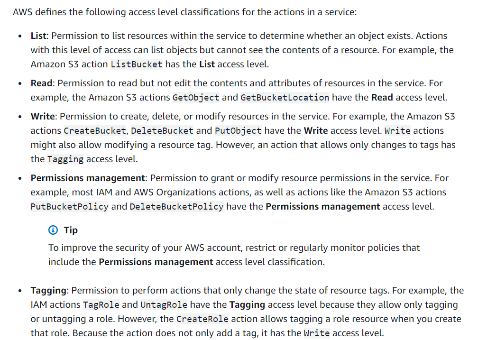

# IAM Security Roles

**Purpose** - To determine IAM security roles to be given to the project team.

## Information
Original creator creates IAM user role and gives it admin privileges.

Create individual users for anyone who needs to access the AWS account. 
- This gives each user a unique set of security credentials, which can be changed or revoked at anytime

## Recommendation
Create the following groups:
- **Administrator:** Permissions Management
- **Developer:** Write, Tagging
- **User:** List, Read

For a later phase in the project, it is also recommended to require multi-factor authentication (MFA) for all IAM users for an added level of security. With MFA, users have a device that generates a response to an authentication challenge. 

The response is generated in one of the following ways:
- Virtual and hardware MFA devices generate a code that you view on the app or device and then enter on the sign-in screen.

- U2F security keys generate a response when you tap the device. The user does not manually enter a code on the sign-in screen.

AWS recommends using U2F or hardware MFA devices for privileged IAM users who are allowed to access sensitive resources or API operations.

## Reference
Amazon Web Service (2020). Securtiy Best Practices. Retrieved from https://docs.aws.amazon.com/IAM/latest/UserGuide/best-practices.html#use-access-levels-to-review-permissions
