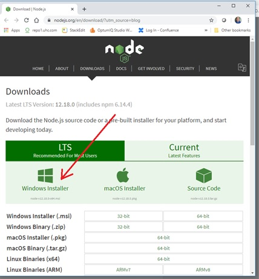
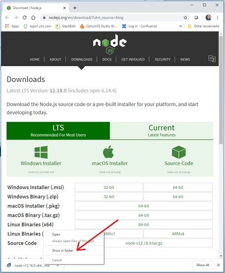
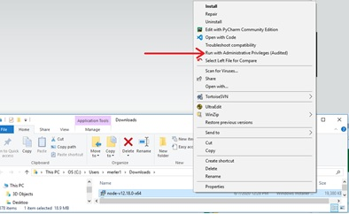
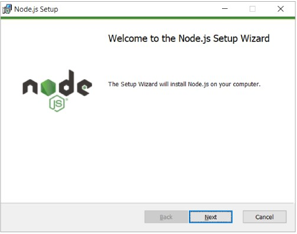
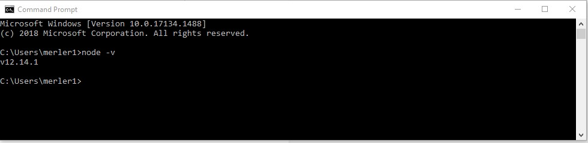
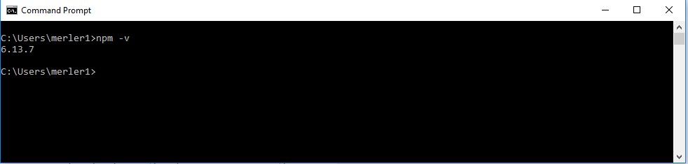
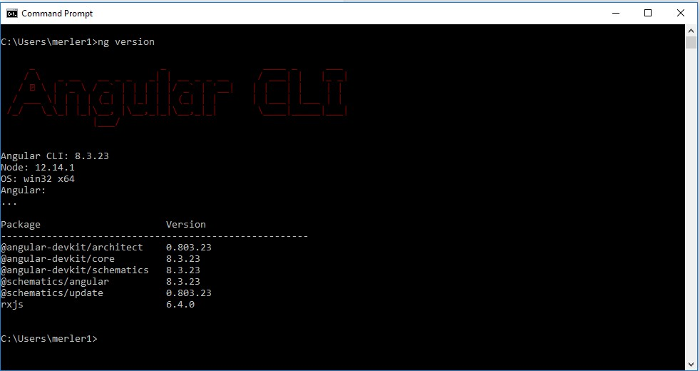

In this document I will walk through the process of installing Node.js and Angular.

# What is Angular?

Angular is an open-source, front-end web application development framework.  Development of Angular is led by the Angular Team at Google and by a community of individuals and corporations.  In this document, we will cover installation procedure of angular on windows 10 operating system.

# What is Node.js?

Node.js is an open-source, cross-platform JavaScript run-time environment that executes JavaScript code outside of a browser. You need Node.js for dev tooling (like local web server with live reloading features) and dev experience.

# What is NPM?

Npm stands for Node Package Manager, it is a dependency management tool for javascript applications. This tool will help to install the libraries and other tools to support angular development.

# Installation Procedure

Step 1: Download nodejs

Open a browser to the nodejs download page [here](https://nodejs.org/en/download/?utm_source=blog) and click on the Windows installer to download the latest version of node installer as indicated in the next screenshot.

  

Step 2: Install Node.js

Right-click on the downloaded node-vxx.xx.x.msi file indicated in the next screenshot and select “show in folder” to go to the download folder.

  

Right-click on the installer and run it with Administrative Privileges as indicated in the next screenshot.

Walk through the installation screens that should begin with something that looks like this:

Step 3: Test the Node.js installation

Open a console window and type **_node -v_**  What you see should look something like this:

(Note: Your version may vary depending on your date of installing as nodejs team make an aggressive release but make sure your node version is > v10.0.0)

In the same console window and type **_npm -v_**  What you see should look something like this:

(Note: Your version may vary depending on your date of installing as nodejs team make an aggressive release but make sure your npm version is >5 )

Step 4: Install Angular CLI

Setting up productive angular development environment would need to configure tools like typescript, webpack and other angular dependencies which are complex to configure for a newbie in angular world. There are several tools that help to alleviate this problem out of which Angular CLI is the easiest to use.  Angular CLI comes with wide range of commands that help manage the angular development, testing and build process.  We will install Angular CLI using npm.  In a console window execute the install command: **_npm install -g @angular/cli_**

Step 5: Test @angular/cli

In a console window type **_ng version_**  What you see should look something like this:

(Note: Your version may vary from what is displayed above)

Congratulations, you have successfully installed @angular/cli